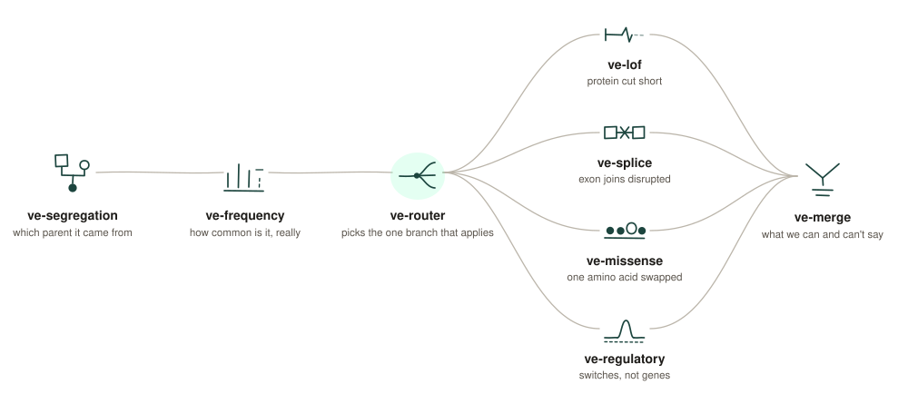

# ve-skills

**Most pipelines rank every variant. This one knows which ones it shouldn't.**

ClawBio Berlin 2026 · Challenge 1 — End the diagnostic odyssey

---

## The pipeline



---

## The problem

Sequencing isn't the bottleneck. Interpretation is.

A pipeline that ranks everything looks confident and hides its blind spots. Ours routes each
variant to the one branch entitled to an opinion — and hands back everything else as an
explicit abstention, with a reason.

---

## The skills

**Before the branch**

| | |
|---|---|
| `ve-segregation` | Which parent each variant came from |
| `ve-frequency` | Genuinely rare — or simply never measured? |
| `ve-router` | Sends each variant to the one branch that applies |

**The branches**

| | |
|---|---|
| `ve-lof` | Is the protein really cut short? |
| `ve-splice` | Does the join between exons break? |
| `ve-missense` | Does the swapped amino acid matter? |
| `ve-regulatory` | Does it hit a switch rather than a gene? |
| `ve-merge` | Ranked list + abstention list |

---

## ve-router — a consequence belongs to a transcript, not a variant

Median 2 annotations per record, up to 16. Something has to choose, and say so.

```
rs5065   1:11906068 A>G
  consequence      STOP_LOST            ← the effect name
  functional_class MISSENSE             ← SnpEff's own label, same record
  routed to        protein_truncating
  discarded        4 alternatives       (kept in result.json)
```

Route on `FunctionalClass` and this goes to AlphaMissense, which cannot score a stop-loss.
Three records in the challenge file hit that trap.

**Annotates when nothing is there.** `EFF` → `ANN` → local `snpEff` → Ensembl VEP REST →
otherwise `unroutable`, with the reason stated.

**Build-aware, because that's a real bug.** Ensembl serves GRCh37 and GRCh38 from different
hosts. Send b37 to the GRCh38 host and you get another position's annotation, silently.

---

## ve-regulatory — real inference, honest reporting

CATv1 accessibility model, CPU, hg38 windows from Ensembl. Live run, `rs12740374` (SORT1):

```json
{
  "variant_key": "1:109274968:G:T",
  "direction": "increases",
  "confidence": "high",
  "evidence": {
    "confirmed_model": "ENCSR562FNN",
    "window": "1:109273911-109276024 (hg38)",
    "predicted_accessibility": { "ref_log_count": 5.8979, "alt_log_count": 6.6510 },
    "magnitude_uncalibrated": { "delta_log_count": 0.7531, "fold_change_approx": 2.127 },
    "contribution_delta": { "delta": 0.75313, "window_bp": 51 },
    "tf_binding_high_attribution_motif_like_position": true
  }
}
```

Three things it refuses to overclaim:

| Reported | Not claimed |
|---|---|
| Predicted accessibility | A called ATAC peak — ENCODE peak BEDs were never consulted |
| Direction of effect | The magnitude. Published evaluation puts this model class ~10× below measured (SORT1 measured ~12-fold, predicted 2.1-fold) |
| A high-attribution, motif-like position | Any transcription factor by name — CATv1 cannot identify one |

**A human picks the cell-type model.** `--propose` returns a ranked shortlist with evidence;
scoring only runs on an accession a person confirmed. A fuzzy match on "liver" can land on a
hepatocyte line, fetal tissue, or a hepatoblastoma line — different biology, confident wrong answer.

---

## What we refuse to say

Nothing here is called rare, pathogenic, diagnostic, de novo or compound heterozygous.

No phenotype. No HPO terms. No valid population-frequency layer. `EFF` is historical
annotation, not current clinical evidence. Parent-of-origin labels are unphased.

**We also found the brief is wrong.** It lists the samples as son, father, mother, sister.
Mother and sister are swapped.

| | Paternal / maternal | Agreement with the given labels |
|---|---|---|
| Derived from the data | 30 / 38 | **68 / 68** |
| Using the brief's order | 11 / 25 (+32 ambiguous) | 36 / 68 |

So the pedigree is derived from the data, never from the prose.

---

## Run it

```bash
python3 skills/ve-router/ve_router.py --demo --output out/
```

All four routing classes, annotated from nothing, build detected from the header:

```bash
python3 skills/ve-router/ve_router.py --input demo/clinvar_all_classes.vcf --output out/
```

```
rs12740374   CELSR2   3_prime_UTR_variant    -> non_coding          src=vep_rest build=GRCh38
rs4988235    MCM6     intron_variant         -> non_coding          src=vep_rest build=GRCh38
rs1800562    HFE      missense_variant       -> missense            src=vep_rest build=GRCh38
rs78756941   CFTR     splice_donor_variant   -> splice              src=vep_rest build=GRCh38
rs75527207   CFTR     missense_variant       -> missense            src=vep_rest build=GRCh38
rs77010898   CFTR     stop_gained            -> protein_truncating  src=vep_rest build=GRCh38
```

---

Data: Corpasome, Manuel Corpas, [DOI 10.6084/m9.figshare.693052](https://figshare.com/articles/dataset/Corpasome/693052), CC BY 4.0.
Research and educational tool. Not a medical device.
