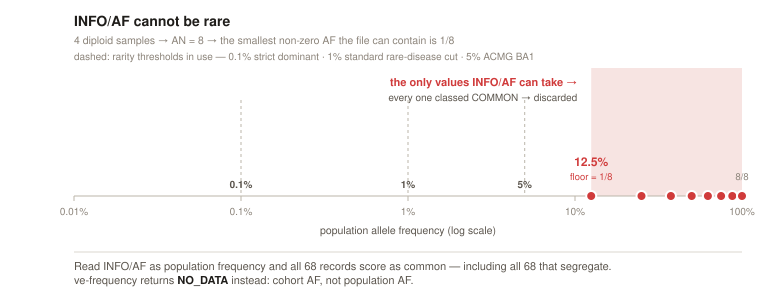
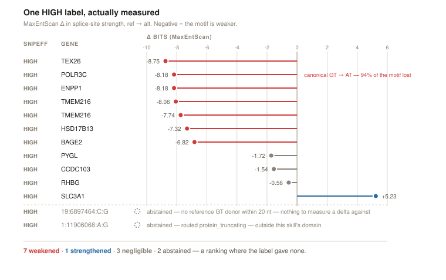
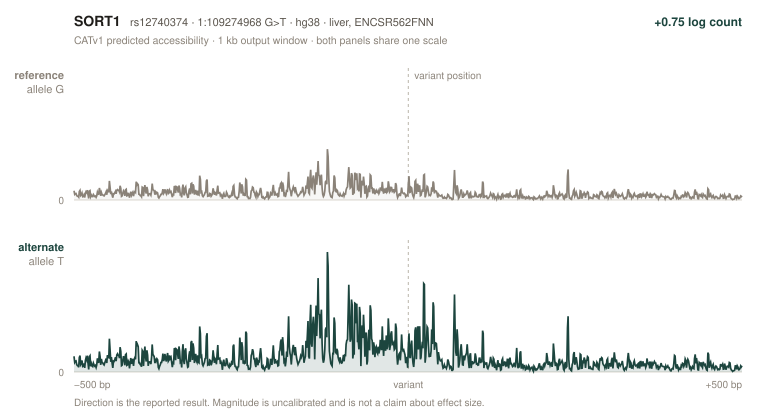

# ve-skills

Variant-effect skills for [ClawBio](https://github.com/ClawBio/ClawBio). A filtered VCF goes
in; each variant is routed to the predictor that applies to it, and anything no predictor can
speak to comes back as an explicit abstention with a reason.

Built at ClawBio Berlin 2026 for Challenge 1, on the publicly consented four-person Corpas
exome pedigree. Each skill is self-contained — no other ClawBio skill is called at runtime.


<details>
<summary>Same pipeline as text</summary>

```
challenge1 VCF (68, b37) ─┐
outside demo sets ────────┤
                          ▼
              ┌────────────────────┐
              │  ve-segregation    │  pedigree genotypes → parent-of-origin
              └─────────┬──────────┘  30 paternal / 38 maternal
                        ▼
                 ┌──────────────┐
                 │ ve-frequency │   build-aware AF provenance
                 └──────┬───────┘   → rare / common / NO-DATA
                        ▼
                 ┌──────────────┐
                 │  ve-router   │   one class per variant × transcript
                 └──────┬───────┘
      ┌──────────┬──────┴──────┬──────────────┬─────────────┐
      ▼          ▼             ▼              ▼             ▼
   ve-lof   ve-missense   ve-splice    ve-regulatory   unroutable
                                                     → abstain
      └──────────┴──────┬──────┴──────────────┴─────────────┘
                        ▼
                 ┌──────────────┐
                 │   ve-merge   │   + segregation evidence
                 └──────┬───────┘
              ranked list + abstention list
```

</details>

## Skills

| Skill | What it does |
|---|---|
| [`ve-segregation`](skills/ve-segregation) | Parent-side segregation across a pedigree. Unphased transmission labels, not molecular phase. |
| [`ve-frequency`](skills/ve-frequency) | Decides whether a population-frequency question can be answered at all, and in which build. |
| [`ve-router`](skills/ve-router) | Assigns one consequence class per variant × transcript, and records what it discarded. |
| [`ve-splice`](skills/ve-splice) | Ref-vs-alt change in splice-site strength (MaxEntScan). |
| [`ve-regulatory`](skills/ve-regulatory) | Ref-vs-alt change in predicted chromatin accessibility (Cherimoya / CATv1). |

---

### `ve-frequency` — the AF in the file is not a population frequency

The VCF offers exactly one frequency field, and it is a trap:

```
AC=2;AF=0.250;AN=8;MLEAC=2;MLEAF=0.250;DP=120;EFF=…;VQSLOD=4.11
     ^^^^^^^^
      GATK cohort AF — two of the eight alleles in THIS FAMILY.
      Not 25% of humans.

population keys present:  AF_TGP  AF_EXAC  AF_ESP  gnomAD_AF
                          ── zero occurrences, all 68 records ──
```

Four diploid samples means `AN = 8`, so the smallest non-zero AF the file can physically
contain is `1/8`. **12.5% is the floor.** Every rarity threshold in use sits below it:

| Threshold | Purpose | vs. the file's floor |
|---|---|---|
| 0.1% | strict dominant | 125× below |
| 1% | standard rare-disease cut | 12.5× below |
| 5% | ACMG BA1 stand-alone benign | 2.5× below |
| **12.5%** | **the file's own minimum** | — |




So reading `INFO/AF` as population frequency scores **all 68 variants as common** —
including all 68 that segregate with the disease. The filter doesn't merely fail, it
**inverts**: the more relatives carry a variant, the more common it looks, and the faster
it is discarded.

| | |
|---|---|
| Naive AF filter | **68 / 68 discarded** as common. Silently — no error, an empty shortlist that looks like a clean result. |
| `ve-frequency` | **68 → `NO_DATA`**, each with a named reason: *cohort AF, not population AF*. The abstention travels downstream as data. |

Build is read from `##reference` and contig lengths, never assumed — our data is b37 and
gnomAD v4 is GRCh38-only. Absence at a covered site is bounded by `~3/AN`; absence at an
uncovered site is `NO_DATA`, never rare.

### `ve-splice` — one HIGH label, actually measured

SnpEff stamps all twelve splice-site variants `HIGH`. Nothing downstream can rank them,
because the label carries no magnitude. `ve-splice` measures the ref-vs-alt change in
splice-site strength:

```
POLR3C  NM_006468.6  exon 5 donor   1:145606274 C>T   GRCh37   paternal
        (gene reads on the − strand, inferred from sequence — so the VCF's C>T
         is a G>A in gene orientation, on the first base of the donor GT)

  REF   GAG | GTAATG      8.73 bits
  ALT   GAG | ATAATG      0.55 bits
              ^
              canonical GT → AT: the cell's cut signal is gone

  Δ  −8.18 bits — a 94% drop
```

Twelve identical `HIGH` labels become **7 weakened · 1 strengthened · 3 negligible ·
1 abstained** — a ranking where there was none.



Every row carries the same `HIGH` stamp on the left. The measured delta on the right spans
14 bits. Shown on the bundled demo set (13 records, two of which the skill declines to score);
the challenge pack's twelve behave the same way.


MaxEntScan (Yeo & Burge 2004), our own port, reproduces all six published reference values
exactly. Strand inferred from sequence for all 11 scorable loci, **correct 11/11** against
Ensembl including five minus-strand genes. SpliceAI scores this variant 0.99 and agrees on
9/11 — run offline as ground truth only, since its licence forbids shipping it.

This is a change in **motif strength**, not an observation of splicing. There is no RNA in
this data to test it against.

### `ve-regulatory` — a non-coding variant, scored against a measured cell type

Nothing in the pedigree is non-coding, so this runs on public variants. `rs12740374` sits in
the *SORT1* locus and is one of the better-characterised regulatory variants in the genome.
CATv1 is run live on CPU: the hg38 window is fetched from Ensembl, the checkpoint from the
Hugging Face Hub, and the reference and alternate sequences are passed through the model.



Both panels share one y-scale. Predicted accessibility rises across the whole window on the
alternate allele — `+0.75` in log counts.

The cell-type model is chosen by a person, not by the skill. `--propose` returns a ranked
shortlist with biosample, assay and per-fold performance, then stops:

```
$ ve_regulatory.py --propose --cell-type liver
proposed 10 candidates for 'liver', chose none

| Accession   | Biosample           | Assay     | count_pearson |
|-------------|---------------------|-----------|---------------|
| ENCSR562FNN | liver               | DNase-seq | 0.889         |
| ENCSR124NNL | liver               | ATAC-seq  | 0.827         |
| ENCSR802ZYE | left lobe of liver  | DNase-seq | 0.844         |
...
```

Scoring only runs once an accession is passed back with `--model`. A fuzzy match on "liver"
can land on a hepatocyte line, fetal tissue or a hepatoblastoma line, and those are different
biology.

Three things this deliberately does not claim:

| Reported | Not claimed |
|---|---|
| Predicted accessibility | A called ATAC peak. ENCODE peak files are never consulted. |
| Direction of change | The magnitude. Published evaluation puts this model class about an order of magnitude below measured effects — SORT1 measures ~12-fold, the model predicts ~2. |
| A high-attribution, motif-like position | Any transcription factor by name. CATv1 is an accessibility model and cannot identify one. |

### What these skills run on

`ve-splice` and `ve-frequency` run fully offline from vendored data. `ve-regulatory` fetches its model checkpoint and sequence window live.

| Tool / resource | Used by | What it does |
|---|---|---|
| **MaxEntScan** (Yeo & Burge 2004) | `ve-splice` | Maximum-entropy model scoring how strongly a 9-mer donor or 23-mer acceptor window looks like a real splice site, in bits. Our own port; score matrices vendored from [maxentpy](https://github.com/kepbod/maxentpy) (MIT). |
| **Indexed FASTA** (`.fa` + `.fai`) | `ve-splice` | Reference sequence for the ref-vs-alt windows, read by random access with the standard library — no `pysam`. `--demo` uses pre-extracted windows, so it needs neither FASTA nor network. |
| **SpliceAI** | `ve-splice` | Deep-learning splice predictor, run **offline as ground truth only** to check our scores (9/11 agree). Its licence forbids shipping it, so it is not a runtime dependency. |
| **Ensembl** | `ve-splice`, `ve-frequency` | Gene strand and transcript coordinates for validation (strand correct 11/11); and the source of the GRCh37→GRCh38 mapping below. |
| **Ensembl liftover chain** (285 KB, vendored) | `ve-frequency` | Coordinate translation b37 → GRCh38, since gnomAD v4 is GRCh38-only. Read by a stdlib chain parser — no `pyliftover`, `CrossMap` or `bcftools`. Validated 4/4 against Ensembl REST and gnomAD's own liftover. |
| **gnomAD v4** | `ve-frequency` | The population-frequency reference the lifted coordinates point at, and the source of the `AF_*` / `gnomAD_AF` key names the gate looks for. Live lookup is supported; the demo runs fully offline. |
| **VCF header** (`##reference`, `##contig`) | `ve-frequency` | Where the reference build is read from, rather than assumed. Conflicting or absent → `NO_DATA`. |
| **Cherimoya / CATv1** | `ve-regulatory` | Sequence-to-function accessibility model, 1,518 ENCODE DNase-seq and ATAC-seq experiments. Checkpoints pulled from the [Hugging Face Hub](https://huggingface.co/programmable-genomics/CATv1); CPU inference, ~2.4 MB per model. |
| **Ensembl REST sequence** | `ve-regulatory` | The 2,114 bp hg38 window around each variant, fetched per variant so no local reference genome is needed. |
| **tangermeme** | `ve-regulatory` | Saturation-mutagenesis attribution at the variant position, on the model's log-count head. |
| **Ensembl VEP REST** | `ve-router` | Consequence annotation when the VCF carries none, from the host matching the file's build — `grch37.rest.ensembl.org` for b37, `rest.ensembl.org` for GRCh38. |

---

## Running

```bash
python3 skills/ve-router/ve_router.py --demo --output out/
```

Every skill has a `--demo` mode. `demo/clinvar_all_classes.vcf` carries curated ClinVar
variants covering all four routing classes; it has no annotation of its own, so routing it
also exercises the VEP fallback and build detection:

```
rs12740374   CELSR2   3_prime_UTR_variant    -> non_coding          src=vep_rest build=GRCh38
rs4988235    MCM6     intron_variant         -> non_coding          src=vep_rest build=GRCh38
rs1800562    HFE      missense_variant       -> missense            src=vep_rest build=GRCh38
rs78756941   CFTR     splice_donor_variant   -> splice              src=vep_rest build=GRCh38
rs75527207   CFTR     missense_variant       -> missense            src=vep_rest build=GRCh38
rs77010898   CFTR     stop_gained            -> protein_truncating  src=vep_rest build=GRCh38
```

## Scope

No variant here is called rare, pathogenic, diagnostic, de novo or compound heterozygous.
The data carries no phenotype and no HPO terms, its `EFF` annotations are historical rather
than current clinical evidence, and the parent-of-origin labels are unphased.

The challenge brief lists the samples as son, father, mother, sister. Mother and sister are
swapped: deriving the roles from the genotypes reproduces the published 30/38 split with
68/68 agreement, while the brief's order gives 11/25 and 36/68. Roles are read from the data.

## Notes

Contracts between skills, the ClawBio skill format and build notes are in
[`docs/DEVELOPMENT.md`](docs/DEVELOPMENT.md).

Data: derived subset of the Corpasome by Manuel Corpas,
[DOI 10.6084/m9.figshare.693052](https://figshare.com/articles/dataset/Corpasome/693052),
CC BY 4.0. Research and educational tool, not a medical device.
